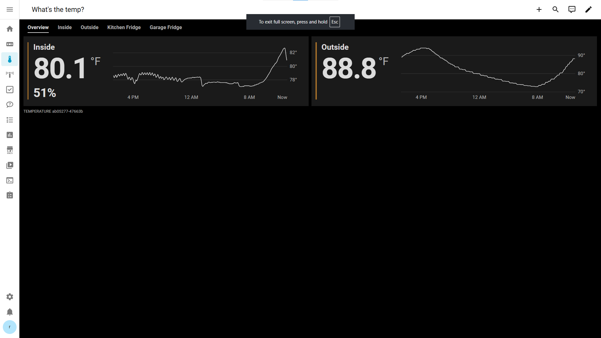
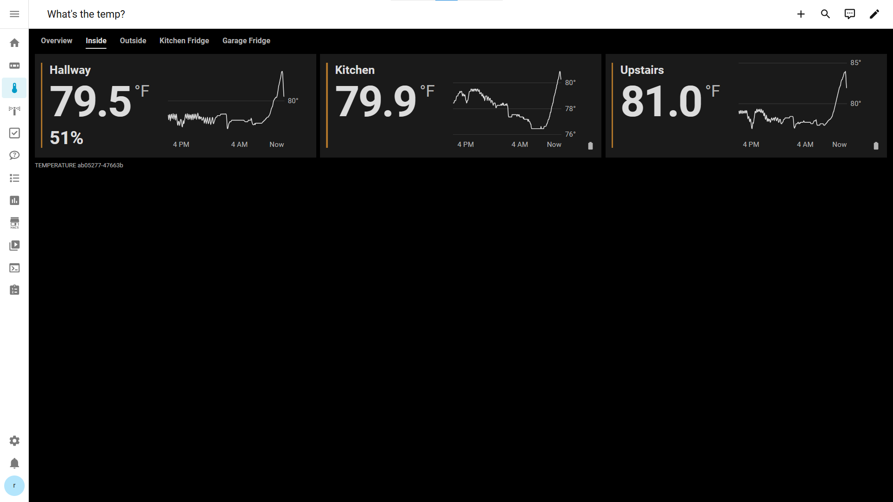
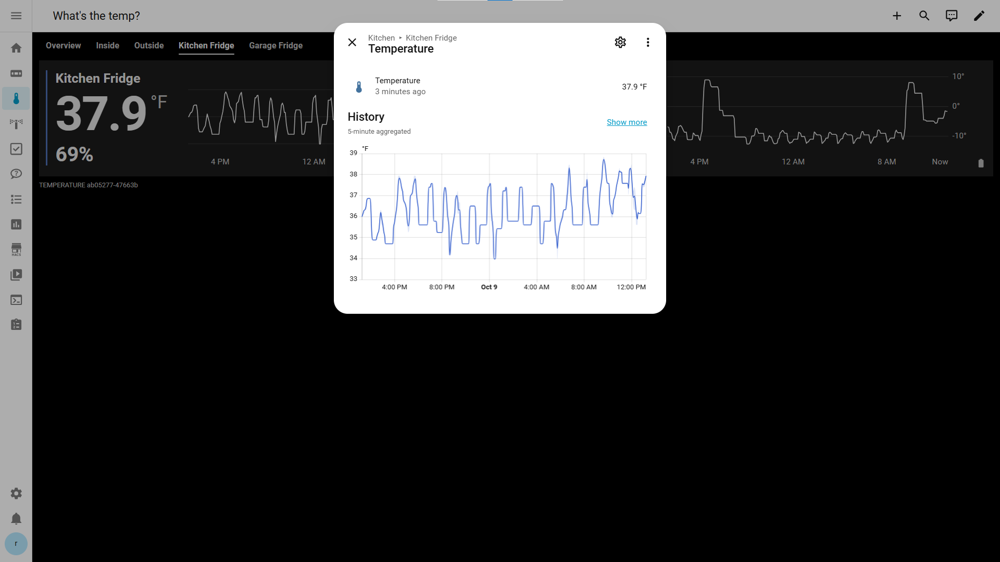

# Temperature Card

A custom [Home Assistant](https://www.home-assistant.io/) dashboard card for
temperature sensors. It shows several sensors in one card as large, easy-to-read
tiles, with optional humidity and battery status, a 24-hour history graph in
each tile that has room for one, and optional tabs that group sensors and show
averages (for example "Inside" and "Outside").

It works with any Home Assistant temperature sensor, follows your dashboard
theme (light or dark), and needs no extra integrations or helper entities.

## Screenshots

### Grouped card with averages



The **Overview** tab of a card with five tabs (Overview, Inside, Outside,
Kitchen Fridge, Garage Fridge). "Inside" and "Outside" are **roll-up** tiles:
each shows the average of several sensors, with an averaged 24-hour history
graph. The colored bar on the left of each tile reflects the current
temperature. The small text under the card is the build tag. (The dark banner
at the top is the browser's own full-screen notice, not part of the card.)

### Individual sensors with history and battery icons



The **Inside** tab shows the three sensors behind the "Inside" average, each
with its own graph. This dashboard places battery icons in the lower-right
corner (`battery_position: lower-right`).

### Full history in Home Assistant's own dialog



Double-clicking (or double-tapping) a sensor's history graph opens Home
Assistant's standard **More Info** dialog for that sensor, with the full,
interactive history.

## Features

- Several temperature sensors in one card, each as a tile with a large,
  readable temperature.
- Optional humidity for each sensor.
- Optional battery indicator for each sensor, using Home Assistant battery
  icons; choose which corner it sits in and whether it is upright or sideways.
- Responsive grid of one to four columns that follows the card's own width.
- A colored bar on each tile that shows at a glance whether a temperature is
  freezing, cold, cool, normal, warm or hot.
- Optional **groups**: tabs that each show a chosen set of tiles, with swipe
  navigation between tabs on touch screens.
- Optional **roll-up** tiles that show the average temperature (and humidity)
  of several sensors, and can open another tab when tapped.
- A **24-hour history graph** in each tile that is wide enough, including an
  averaged history for roll-ups. Graphs come from Home Assistant's recorder.
- Double-click or double-tap a sensor's graph to open Home Assistant's own
  history dialog for it.
- Uses your Home Assistant theme, font, number format, units and 12/24-hour
  time setting.
- A small build tag on every card to help with troubleshooting.

## Requirements

- Home Assistant with dashboards (Lovelace). History graphs use the recorder,
  which is enabled by default.
- To build the card: [Node.js](https://nodejs.org/) 18 or newer, with npm.
- A way to copy files into your Home Assistant `config` folder (for example the
  Samba share, File editor or Studio Code Server add-ons, or SSH).

## Installation

There is no HACS package and no prebuilt download at the moment, so the card
is installed manually: you build it once, copy two files into Home Assistant,
and register one of them as a dashboard resource.

### 1. Build the card

Download this repository (with `git clone` or GitHub's **Code → Download ZIP**),
then in its folder run:

```sh
npm install
npm run build
```

This creates `dist/temperature-card.js`. The other file you need, `loader.js`,
is in the repository's top folder.

### 2. Copy the two files into Home Assistant

In your Home Assistant configuration folder (the folder that contains
`configuration.yaml`), create a folder `www/temperature-card/` and copy both
files into it:

```text
config/
└── www/
    └── temperature-card/
        ├── loader.js              (from the repository's top folder)
        └── temperature-card.js    (from dist/)
```

- The folder name must be exactly `temperature-card`: `loader.js` loads the
  card from `/local/temperature-card/temperature-card.js`.
- Home Assistant publishes `config/www/` at the address `/local/`, so these
  files become `/local/temperature-card/loader.js` and
  `/local/temperature-card/temperature-card.js`.
- If the `www` folder did not exist before, restart Home Assistant once so it
  starts serving `/local/`.

### 3. Register the loader as a dashboard resource

In Home Assistant, go to **Settings → Dashboards**, open the three-dots menu
(top right) and choose **Resources**, then **Add resource**:

| URL | Resource type |
| --- | --- |
| `/local/temperature-card/loader.js` | JavaScript module |

Register **only `loader.js`**, not `temperature-card.js`. The loader fetches
the card itself, with a fresh query string on every page load, so a newly
copied version is picked up without changing the resource or fighting the
browser cache.

If you do not see **Resources**, turn on **Advanced mode** in your user
profile. The exact menu wording can vary slightly between Home Assistant
versions.

If your dashboard resources are managed in YAML instead, add the same resource
to `configuration.yaml`:

```yaml
lovelace:
  resource_mode: yaml
  resources:
    - url: /local/temperature-card/loader.js
      type: module
```

### 4. Reload the page

Custom cards are loaded when the dashboard page loads, so reload it after
installing or updating: a hard refresh in a browser (Ctrl+F5, or Cmd+Shift+R on
a Mac), or close and reopen the Home Assistant app. Clearing the browser cache
should only be needed if a reload does not help (see
[Troubleshooting](#troubleshooting)).

### 5. Add the card to a dashboard

Edit a dashboard, choose **Add card**, pick the **Manual** card (YAML), and
paste a configuration. The card has no visual editor; it is configured in YAML.
A minimal example:

```yaml
type: custom:temperature-card
sensors:
  - name: Patio
    temp_entity: sensor.backyard_patio_temperature
```

Replace `sensor.backyard_patio_temperature` with one of your own temperature
sensors (you can find entity IDs under **Settings → Devices & services →
Entities**). More examples are under [Configuration](#configuration).

### 6. Check that it worked

- The card shows your sensor's name and current temperature.
- Below the card is a small build tag. When you install by hand it reads
  `__TEMPERATURE_CARD_BUILD__`; that is expected (only the project's own
  deployment script fills in a version identifier).
- The browser's developer console (F12) shows a line starting with
  `temperature-card` when the card loads.

## Updating

1. Get the latest version of this repository (for example `git pull`) and run
   `npm install` and `npm run build` again.
2. Copy the new `dist/temperature-card.js` (and `loader.js`) over the old files
   in `config/www/temperature-card/`.
3. Reload the dashboard page. The resource does not need to change.

## Configuration

### Card options

| Option | Required | Default | Description |
| --- | --- | --- | --- |
| `type` | Yes | | `custom:temperature-card` |
| `sensors` | Yes, unless `entity` is used | | The list of sensors (see below). Without `groups`, every sensor is shown, in this order. |
| `entity` | | | Shorthand for a card with a single sensor: just its temperature entity. Use either `entity` or `sensors`, not both. |
| `groups` | No | | Tabs that each show a chosen set of tiles. See [Groups and roll-ups](#groups-and-roll-ups). |
| `temperature_precision` | No | `1` | Decimals shown for every temperature on the card: a whole number from 0 to 3. |
| `humidity_precision` | No | `0` | Decimals shown for every humidity on the card: a whole number from 0 to 3. |
| `battery_position` | No | `upper-right` | Corner of each tile for the battery icon: `upper-left`, `upper-right`, `lower-left` or `lower-right`. |
| `battery_orientation` | No | `vertical` | `vertical` (terminal at the top) or `horizontal` (terminal pointing right). |

The precision options replace each entity's own display precision on this
card. Numbers still use your Home Assistant number format (decimal separator
and digit grouping) and each entity's unit, so Celsius, Fahrenheit and Kelvin
sensors all work.

### Sensor options

Each item in `sensors`:

| Key | Required | Description |
| --- | --- | --- |
| `temp_entity` | Yes | The temperature sensor's entity ID. |
| `name` | No | Name shown on the tile. Defaults to the entity's friendly name. |
| `humidity_entity` | No | A humidity sensor shown under the temperature, as a percentage (for example `52%`). |
| `battery_entity` | No | A battery-level sensor (percent) shown as a small battery icon. |
| `id` | No | A short, unique name (for example `kitchen_fridge`) used to refer to this sensor in `groups`. |

An invalid configuration (for example a missing `temp_entity` or a misspelled
option value) shows Home Assistant's error card with a message explaining what
to fix.

### Examples

Several sensors, with humidity and battery:

```yaml
type: custom:temperature-card
sensors:
  - name: Hallway
    temp_entity: sensor.hallway_temperature
    humidity_entity: sensor.hallway_humidity

  - name: Kitchen Fridge
    temp_entity: sensor.kitchen_fridge_temperature
    humidity_entity: sensor.kitchen_fridge_humidity
    battery_entity: sensor.kitchen_fridge_battery

  - name: Garage
    temp_entity: sensor.garage_temperature
    battery_entity: sensor.garage_sensor_battery
```

One sensor, using the shorthand:

```yaml
type: custom:temperature-card
entity: sensor.backyard_patio_temperature
```

Whole-number temperatures, with the battery icon lying sideways in the
lower-right corner:

```yaml
type: custom:temperature-card
temperature_precision: 0
battery_position: lower-right
battery_orientation: horizontal
sensors:
  - name: Garage Fridge
    temp_entity: sensor.garage_fridge_temperature
    battery_entity: sensor.garage_fridge_battery
```

A complete grouped example is in the next section, and
[`examples/lovelace.yaml`](examples/lovelace.yaml) has a commented one.

### Older option names

Earlier versions used `entity` and `humidity` inside each `sensors` item. They
still work, but new configurations should use `temp_entity` and
`humidity_entity`. (The top-level `entity` shorthand is not affected.)

## Groups and roll-ups

Add a `groups` list to split the card into tabs. The tabs appear in the order
you list them, and each shows its own set of tiles. To use a sensor in a group,
give it an `id`.

```yaml
type: custom:temperature-card
sensors:
  - id: kitchen
    name: Kitchen
    temp_entity: sensor.kitchen_temperature
  - id: hallway
    name: Hallway
    temp_entity: sensor.hallway_temperature
    humidity_entity: sensor.hallway_humidity
  - id: upstairs
    name: Upstairs
    temp_entity: sensor.upstairs_temperature
  - id: patio
    name: Patio
    temp_entity: sensor.patio_temperature
  - id: garage
    name: Garage
    temp_entity: sensor.garage_temperature

groups:
  - id: overview
    name: Overview
    items:
      - name: Inside
        average: [kitchen, hallway, upstairs]
        open_group: inside
      - name: Outside
        average: [patio, garage]
        open_group: outside

  - id: inside
    name: Inside
    items:
      - kitchen
      - hallway
      - upstairs

  - id: outside
    name: Outside
    items:
      - patio
      - garage
```

Each group has:

| Key | Required | Description |
| --- | --- | --- |
| `id` | Yes | A unique name for the group (used by `open_group`). |
| `name` | Yes | The tab label. |
| `items` | Yes | The tiles in this tab, in order (at least one). |

Each item is either:

- **a sensor `id`** (for example `- hallway`): that sensor's normal tile. A
  sensor can appear in several groups; or
- **a roll-up**, which shows an average:

  | Key | Required | Description |
  | --- | --- | --- |
  | `name` | Yes | The tile's name. |
  | `average` | Yes | The sensor `id`s to average (at least one). |
  | `open_group` | No | The `id` of a group to switch to when the tile is clicked or tapped. |

### How roll-ups work

- The temperature is the average of the sensors that currently have a reading.
  Unavailable, unknown or missing sensors are left out; if none has a reading,
  the tile shows "Unavailable".
- Sensors in different units (°F, °C, K) are converted before averaging, and
  the result is shown in your Home Assistant temperature unit.
- Humidity is the average of the members' humidity sensors that have a
  reading. If none of them has humidity, the tile shows no humidity.
- The history graph shows the average of the same sensors over the last 24
  hours: one line, not one per sensor.
- Roll-ups never show a battery icon, and their graphs do not open the history
  dialog (they are calculated values, not a single Home Assistant entity).
- With `open_group`, clicking or tapping the tile switches the card to that
  tab. It stays on the same dashboard.

### Switching tabs

- Click or tap a tab.
- On a touch screen, swipe left or right across the tiles to move to the next
  or previous tab. Swiping stops at the first and last tab, and scrolling the
  page up and down works as usual.
- Click or tap a roll-up that has `open_group`.
- With the keyboard: focus the tab row, then use the Left and Right arrow keys
  (Home and End jump to the first and last tab).

If there are more tabs than fit, the tab row scrolls sideways. The first tab is
shown when the dashboard loads; the card keeps your selected tab while sensors
update, but does not remember it across page reloads.

Without `groups`, the card simply shows all of its sensors in one grid.

## History graphs

When a tile is wide enough, the card draws that sensor's temperature over the
last 24 hours on the right-hand side of the tile, next to the reading. There is
nothing to configure.

- **When a graph appears** depends only on how wide each tile is, not on your
  screen. Wide tiles, such as two or three across a full-width desktop
  dashboard (as in the screenshots), show a graph. Narrow tiles, such as on a
  phone or four across, do not, and look exactly as they would without the
  feature.
- **What it shows:** one line, a few faint guide lines labelled with round
  temperatures, and local times underneath (for example `4 PM  12 AM  8 AM
  Now`), using your 12- or 24-hour setting. The vertical scale follows the
  sensor's own range over the day, so a fridge's small cycles stay visible.
  If a sensor was unavailable for a while, the line has a gap there.
- **Where the data comes from:** Home Assistant's recorder, the same data as
  Home Assistant's own history: 5-minute statistics for sensors that have them,
  otherwise the recorded states. No helper entities are needed.
- **Updates:** the graph refreshes every few minutes. The large current
  temperature updates immediately, as always.
- **No history:** if Home Assistant has no recorded history for a sensor, its
  tile simply shows no graph.

### Opening the full history

For an individual sensor's graph:

| Action | Result |
| --- | --- |
| Single click or tap | Nothing (so swiping between tabs over a graph is safe) |
| Double-click (mouse) | Opens Home Assistant's More Info dialog for that sensor |
| Double-tap (touch screen) | Opens Home Assistant's More Info dialog for that sensor |
| Enter or Space (keyboard, graph focused) | Opens Home Assistant's More Info dialog for that sensor |

The dialog is Home Assistant's own, for the sensor's `temp_entity`, so it
provides the full history, time range controls and statistics. Swiping across
a graph still switches tabs and never opens the dialog. Roll-up graphs do not
open anything.

## Battery indicator

When a sensor has a `battery_entity`, its tile shows a small battery icon. The
icon's fill shows the level; the exact percentage appears in its tooltip and is
read by screen readers.

| Level | Icon | Color |
| --- | --- | --- |
| 90–100% | `mdi:battery` | normal |
| 80–89% | `mdi:battery-90` | normal |
| 70–79% | `mdi:battery-80` | normal |
| 60–69% | `mdi:battery-70` | normal |
| 50–59% | `mdi:battery-60` | normal |
| 40–49% | `mdi:battery-50` | normal |
| 30–39% | `mdi:battery-40` | low: your theme's warning color |
| 20–29% | `mdi:battery-30` | low |
| 15–19% | `mdi:battery-20` | low |
| 10–14% | `mdi:battery-20` | critical: your theme's error color |
| 1–9% | `mdi:battery-10` | critical |
| 0% | `mdi:battery-outline` | critical |

An unavailable or missing battery sensor shows a faint
`mdi:battery-unknown` icon and never affects the temperature or humidity.

`battery_position` and `battery_orientation` apply to every tile on the card:

- The corners are those of the **whole tile**. With `upper-right` or
  `lower-right`, the icon sits at the tile's right edge, beyond the history
  graph; the graph leaves room for it.
- Upper corners line up with the sensor name; lower corners with the bottom of
  the tile's text. On the left, the icon stays clear of the colored bar.
- The text next to the icon moves aside slightly so they never overlap.
- The position stays the same at every card width.

For example, `battery_position: lower-right` with
`battery_orientation: vertical` gives the layout in the second screenshot.

## Temperature colors

The colored bar on the left of each tile shows the current temperature band.
The bands are built in and need no configuration:

| Temperature | Band and color |
| --- | --- |
| below 32 °F (0 °C) | freezing: ice blue |
| 32 °F to below 50 °F | cold: blue |
| 50 °F to below 65 °F | cool: teal |
| 65 °F to below 78 °F | normal: green |
| 78 °F to below 90 °F | warm: amber |
| 90 °F (32.2 °C) and above | hot: red |

Celsius and Kelvin sensors are classified at the same physical temperatures.
Roll-ups use their average. Only the bar changes color; everything else
follows your theme. A sensor with no reading, or with a unit the card does not
recognize, keeps your theme's accent color.

## Layout and readability

- The grid shows one to four columns depending on the card's width. It prefers
  fewer columns of readable tiles over more columns of small ones, and text
  sizes follow your browser's font size setting.
- A temperature and its unit (for example `78.4 °F`) always stay together on
  one line, as do a humidity value and its `%`. If a tile's history graph
  would crowd the reading, the graph gets narrower or is left out of that tile;
  the reading is never split.
- If a sensor has no reading, the tile says so ("Unavailable", "No reading" or
  "Entity not found") instead of showing a number; a missing humidity reading
  shows `--%`.
- Colors, surfaces and fonts come from your Home Assistant theme, so the card
  suits both light and dark themes.
- Tabs, roll-up tiles with `open_group`, and sensor history graphs can all be
  reached and used with the keyboard. Switching tabs plays a short animation,
  which is skipped if your system is set to reduce motion.

## Troubleshooting

### "Custom element doesn't exist: temperature-card" (or the card never appears)

- Check that the resource URL is exactly `/local/temperature-card/loader.js`
  and its type is **JavaScript module**.
- Check that both `loader.js` and `temperature-card.js` are in
  `config/www/temperature-card/` (that exact folder name).
- If you just created the `www` folder, restart Home Assistant once.
- Reload the page (hard refresh, or close and reopen the app).
- In the browser's developer console (F12), a message "Failed to load
  temperature card" means the loader could not fetch
  `/local/temperature-card/temperature-card.js`; check the file location.

### An error card with a message

The configuration has a problem; the message names the option to fix, for
example a missing `temp_entity`, a group item that refers to an unknown sensor
`id`, or an unsupported `battery_position` value.

### The old version is still showing after an update

- Make sure the new `temperature-card.js` really replaced the old file in
  `config/www/temperature-card/`.
- Reload the page with a hard refresh, or fully close and reopen the Home
  Assistant app. The Home Assistant Companion app also has a "reset frontend
  cache" option in its settings.
- If the problem persists, clear the browser's cached files for your Home
  Assistant site.

### No history graph

- The tile may be too narrow. Make the card wider (for example a full-width
  section or panel view) or put fewer tiles in a tab.
- The graph appears a moment after the card loads, once its history has been
  fetched.
- Check that the sensor has history in Home Assistant (open it in
  **History**). Sensors excluded from the recorder have no graph.
- A tile can also leave its graph out when the reading needs the room (see
  [Layout and readability](#layout-and-readability)).

### No humidity or battery shown

- Check that `humidity_entity` or `battery_entity` is set for that sensor and
  spelled correctly.
- `--%` means the humidity sensor exists but has no reading (or was not found);
  a faint battery icon with a question mark means the battery sensor is
  unavailable or missing.
- Roll-up tiles never show a battery.

### Double-click or double-tap does not open the history

- The graph must be visible in that tile.
- Only individual sensor graphs open the dialog; roll-up graphs do not.
- A single click or tap does nothing by design. On a touch screen, tap twice
  quickly in the same spot; moving your finger while tapping counts as a swipe.
- With the keyboard, focus the graph and press Enter or Space.

## Limitations

- Manual installation only (no HACS package yet), and YAML-only configuration
  (no visual editor).
- The history graph always covers the last 24 hours and has no options.
- The temperature color bands are fixed.
- The selected tab is not remembered across page reloads.
- Roll-up graphs do not open a history dialog, because a roll-up is not a
  single Home Assistant entity.

## Building from source (developers)

```sh
npm install
npm run typecheck   # TypeScript check
npm run build       # writes dist/temperature-card.js (and a source map)
npm run dev         # rebuild automatically on change
```

The source is `src/temperature-card.ts`; `dist/` is generated and not stored
in Git. Contributor notes and project history are in [CLAUDE.md](CLAUDE.md).

`deploy.ps1` is the project's own Windows helper for the maintainer's setup,
where the Home Assistant `config` share is mapped as drive `Z:`. It builds the
card, copies the two files to `www\temperature-card\` on that share, and
stamps the build tag with the Git commit and a file hash (for example
`TEMPERATURE ab05277-47663b`). It is not needed for a normal installation; to
use it elsewhere, edit `$HaConfigShare` at the top of the script.

## License

GPL-3.0-only. See [LICENSE](LICENSE).
